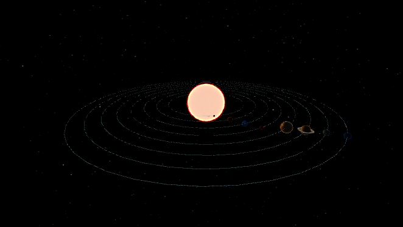

# Solar System ( Three.js )



The Solar System is a simple representation of the eight planets (yes, Pluto is no longer considered a planet) orbiting the Sun. The inspiration for this project came from a client's representative whose project I worked on. Yes, that's you—the one who believes the Earth is flat. In general, this project is just an example of using [Three.js](https://threejs.org/) to create cool animations. More about how it wa build can be found in this [article](https://dev.to/cookiemonsterdev/solar-system-with-threejs-3fe0).

## Assets

Mistry all textures textures were taken from [Planetary Pixel Emporium](https://planetpixelemporium.com/index.php) site, the the exception are only planets rings and stars texture. I'm sure there are plenty different and better textures around the internet so feel free to replace them as you see fit

## Quick Start

1. Install dependencies

```sh
npm i
```

2. Run the app

```sh
npm run dev
```